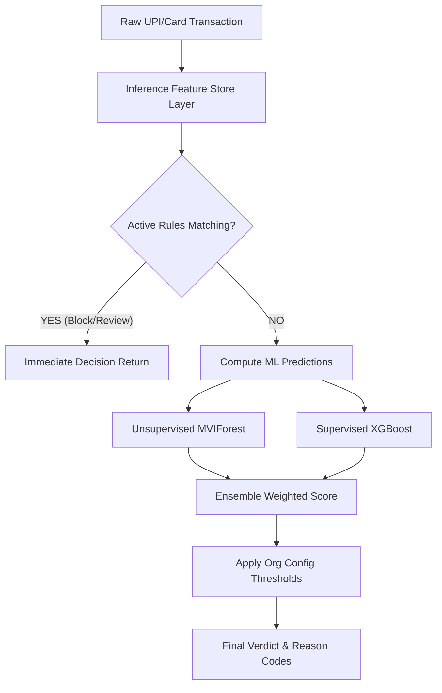

# Flowshield AI: Production Engineering Blueprint
*Author: Principal ML Engineer + FinTech Security Architect + SaaS CTO*

This document serves as the implementation blueprint for Flowshield AI's real-time fraud detection engine, specifically tailored for the Indian fintech and e-commerce landscape. Grounded directly in your current stack (**FastAPI + React + PostgreSQL on Neon + Redis/Kafka on Upstash + Railway/Vercel + MVIForest + XGBoost + SHAP**), this architecture optimizes for sub-100ms latency, zero-cost/low-cost operability, and solo-founder maintainability.

---

# SECTION 1 — FEATURE ENGINEERING & LIGHTWEIGHT FEATURE STORE

To achieve high fraud detection accuracy for Indian payment patterns (especially UPI and card fraud), we expand the current 17-feature set to **74 features**. These are mapped directly to their data sources, real-time/batch calculation tiers, and signal strengths.

## 1.1 Indian Payment Fraud Feature Catalog

| Category | Feature Name | Computation Logic & Formula | Raw Data Source | Calculation Tier | Fraud Signal Strength (Indian UPI/Card) |
|---|---|---|---|---|---|
| **Transaction** | `amount_inr` | `amount * conversion_factor(currency)` | `transactions.amount`, `transactions.currency` | Real-time | **HIGH** (UPI limits, high velocity card testing) |
| | `is_round_amount` | `1 if amount_inr % 100 == 0 or amount_inr % 500 == 0 else 0` | Derived from `amount_inr` | Real-time | **MEDIUM** (Common in UPI collect/fake refund scams) |
| | `amount_log` | `log1p(amount_inr)` | Derived from `amount_inr` | Real-time | **MEDIUM** |
| | `is_micro_upi` | `1 if amount_inr < 50 and channel == 'upi' else 0` | `amount_inr`, `channel` | Real-time | **HIGH** (Card testing/Account verification scams) |
| | `is_high_value_upi` | `1 if amount_inr > 50000 and channel == 'upi' else 0` | `amount_inr`, `channel` | Real-time | **HIGH** (UPI daily limit maxing/unusual high-value transfers) |
| | `card_type_risk` | Risk weight mapped to card bin: credit (0.2), debit (0.1), prepaid/gift (0.9) | `transactions.card_type` | Real-time | **MEDIUM** (Prepaid/virtual cards are used for trial abuse) |
| | `channel_risk_score` | Score: `upi_collect` (0.8), `imps` (0.6), `upi` (0.3), `web` (0.4), `app` (0.1) | `transactions.channel` | Real-time | **HIGH** (UPI Collect requests are highly abused) |
| | `is_international_tx` | `1 if currency != 'INR' else 0` | `transactions.currency` | Real-time | **MEDIUM** (Cross-border cards on domestic gates) |
| | `amount_fractional_part` | `amount_inr - floor(amount_inr)` | Derived from `amount_inr` | Real-time | **LOW** |
| | `mcc_risk_tier` | Mapped tier: High risk (crypto/gambling) = 2, Med risk = 1, Low risk = 0 | `transactions.merchant_category` | Real-time | **HIGH** (UPI off-ramp fraud relies on specific MCCs) |
| **Velocity (Rolling)** | `tx_count_1h` | Count of transactions in last 1 hour by `customer_id` | Redis sorted set | Real-time | **HIGH** (Account takeover and card velocity) |
| | `tx_count_24h` | Count of transactions in last 24 hours by `customer_id` | Redis sorted set | Real-time | **HIGH** (Velocity threshold limits) |
| | `tx_count_7d` | Count of transactions in last 7 days by `customer_id` | Postgres transaction history | Batch / Cached | **MEDIUM** |
| | `amount_sum_1h` | Sum of transactions in last 1 hour by `customer_id` | Redis sorted set | Real-time | **HIGH** (Rapid money out/mule transfer) |
| | `amount_sum_24h` | Sum of transactions in last 24 hours by `customer_id` | Redis sorted set | Real-time | **HIGH** (Daily limit draining) |
| | `amount_sum_7d` | Sum of transactions in last 7 days by `customer_id` | Postgres transaction history | Batch | **MEDIUM** |
| | `distinct_merchants_1h` | Count of distinct `merchant_id` in last 1 hour by `customer_id` | Redis sorted set | Real-time | **HIGH** (Card testing across multiple aggregators) |
| | `distinct_merchants_24h` | Count of distinct `merchant_id` in last 24 hours by `customer_id` | Redis sorted set | Real-time | **HIGH** (Multi-merchant cashouts) |
| | `distinct_merchants_7d` | Count of distinct `merchant_id` in last 7 days by `customer_id` | Postgres transaction history | Batch | **MEDIUM** |
| | `tx_velocity_ratio_1h_24h`| `tx_count_1h / (tx_count_24h + 1)` | Derived from velocity counts | Real-time | **HIGH** (Sudden burst of activity) |
| | `amount_velocity_ratio` | `amount_sum_1h / (amount_sum_24h + 1)` | Derived from velocity sums | Real-time | **HIGH** |
| | `distinct_devices_24h` | Count of distinct `device_fingerprint` used by `customer_id` in last 24h | Redis sorted set | Real-time | **HIGH** (Emulator farm login rotation) |
| **Device & Browser**| `is_new_device` | `1 if device_fingerprint is not in customer profile history else 0` | Postgres customer devices | Real-time | **HIGH** (SIM swap, credential stuffing cashouts) |
| | `device_age_days` | `current_timestamp - first_seen_timestamp(device_fingerprint)` | Postgres materialized view | Batch / Cached | **MEDIUM** |
| | `device_tx_count_24h` | Count of transactions across all customers with this `device_fingerprint` | Redis sorted set | Real-time | **HIGH** (Device sharing among fraud rings/emulators) |
| | `device_associated_users_7d`| Distinct `customer_id` count on this device in the last 7 days | Postgres transaction logs | Batch | **HIGH** (Emulator fraud rings using single node) |
| | `is_webview` | `1 if user_agent contains "wv" or "WebView" else 0` | `user_agent` (metadata) | Real-time | **HIGH** (Malicious apps launching hidden UPI frames) |
| | `is_bot_user_agent` | `1 if user_agent matches known headless/automation regex else 0`| `user_agent` (metadata) | Real-time | **HIGH** (Scripted checkout attacks) |
| | `is_fingerprint_missing` | `1 if device_fingerprint is NULL or empty else 0` | `transactions.device_fingerprint`| Real-time | **HIGH** (Fraudsters blocking telemetry scripts) |
| | `ua_os_class` | Category index: Android (1), iOS (2), Windows (3), Mac (4), Unknown (0)| `user_agent` (metadata) | Real-time | **MEDIUM** (iOS is lower fraud risk in India than root Android) |
| | `ua_browser_class` | Category index: Chrome (1), Safari (2), WebView (3), Bot (4), Other (0) | `user_agent` (metadata) | Real-time | **MEDIUM** |
| | `screen_res_risk` | `1 if resolution is standard emulator (e.g., 1080x1920 exactly) else 0`| Client resolution (metadata)| Real-time | **MEDIUM** (Emulator bot matching) |
| **IP & Location** | `ip_country_match` | `1 if customer_country == geoip_country else 0` | `transactions.customer_country`, GeoIP| Real-time | **HIGH** (Proxied payments bypassing Rbi rules) |
| | `ip_city_match` | `1 if customer_city == geoip_city else 0` (if billing city provided) | `transactions.customer_city`, GeoIP | Real-time | **MEDIUM** (Mismatched delivery vs IP city) |
| | `is_vpn_or_hosting` | `1 if GeoIP ASN matches VPN/Hosting/Cloud provider list else 0` | GeoIP ASN lookup | Real-time | **HIGH** (Fraudsters hiding behind commercial VPNs) |
| | `ip_asn_risk_tier` | ASN risk: Cloud hosting (2), standard mobile Jio/Airtel (0), local ISP (1)| GeoIP ASN lookup | Real-time | **HIGH** (Hosting IPs are automatically high risk) |
| | `distance_from_last_tx_km`| Haversine distance between current GeoIP and previous transaction GeoIP | Postgres transaction logs | Real-time | **HIGH** (Impossible travel / simultaneous logins) |
| | `speed_from_last_tx` | `distance_from_last_tx_km / (time_since_last_tx_hours + 0.01)` | Derived from location logs | Real-time | **HIGH** (Simultaneous login detection) |
| | `ip_tx_count_24h` | Count of transactions across all customers with this IP in last 24h | Redis sorted set | Real-time | **HIGH** (Proxy farms or shared compromised VPNs) |
| | `ip_distinct_users_24h` | Distinct `customer_id` count using this IP in the last 24 hours | Redis sorted set | Real-time | **HIGH** (Proxy farm detection) |
| | `ip_region_fraud_rate` | Historical fraud rate of IP state (e.g., Jamtara/Nuh/Bharatpur = High risk)| Postgres materialized view | Batch | **HIGH** (Specific hotspots account for 60%+ UPI scams) |
| **Behavioral** | `is_night` | `1 if hour_of_day < 6 or hour_of_day >= 22 else 0` | Derived from local time | Real-time | **MEDIUM** (SIM swap fraud cashout hours) |
| | `time_since_last_tx` | Seconds elapsed since previous transaction of `customer_id` | Redis key (timestamp) | Real-time | **HIGH** (Rapid card testing or bot checkouts) |
| | `failed_attempts_10m` | Count of failed transaction attempts in last 10 minutes | Redis counter | Real-time | **HIGH** (Card brute-forcing) |
| | `amount_vs_avg_ratio` | `amount_inr / (customer_avg_amount_30d + 1)` | Postgres materialized view | Real-time | **HIGH** (Sudden high-value transfer) |
| | `is_amount_exceeding_avg` | `1 if amount_vs_avg_ratio > 3 else 0` | Derived from avg ratio | Real-time | **HIGH** (Spike in activity size) |
| | `session_duration_sec` | Time between session init and checkout (if client metadata available) | Session tracking metadata | Real-time | **MEDIUM** (Instant checkouts denote automated bots) |
| | `keystroke_velocity_score`| Average keystroke speed (if client telemetry integration enabled) | Telemetry metadata | Real-time | **LOW** |
| | `hours_since_pwd_reset` | Hours elapsed since password reset | User account records | Real-time | **HIGH** (Account takeover cashout pattern) |
| **Identity Heuristics**| `email_domain_risk` | Mapped risk: Free/disposable (0.9), corporate (0.05), Gmail/Yahoo (0.1) | `customer.email` | Real-time | **HIGH** (Temp-mail domains for fake signups) |
| | `is_temp_email` | `1 if email domain is in disposable list else 0` | `customer.email` | Real-time | **HIGH** (Disposable email lists) |
| | `email_handle_length` | Length of characters before `@` in email | `customer.email` | Real-time | **LOW** (Autogenerated emails are often long) |
| | `email_digit_ratio` | Count of digits / length of email handle | `customer.email` | Real-time | **MEDIUM** (e.g., `rahul8976214@gmail.com`) |
| | `phone_carrier_risk` | Carrier risk index: Jio (0.1), Airtel (0.1), Vi (0.2), BSNL/Virtual (0.6) | `customer.phone` (regex prefix) | Real-time | **MEDIUM** (Virtual/VoIP numbers are high risk) |
| | `is_phone_valid_india` | `1 if phone matches ^[6-9]\d{9}$ (after stripping +91) else 0` | `customer.phone` | Real-time | **HIGH** (Fake phone structures) |
| | `is_email_valid` | `1 if email matches standard email RFC regex else 0` | `customer.email` | Real-time | **MEDIUM** |
| | `phone_matches_upi_vpa` | `1 if phone number digits exist inside customer UPI VPA else 0` | Customer VPA (metadata) | Real-time | **MEDIUM** (Validates legitimate setup) |
| **Merchant Risk** | `merchant_fraud_rate_30d`| Count of fraud alerts / total transactions for merchant in 30d | Postgres materialized view | Batch | **HIGH** (Compromised merchant accounts) |
| | `merchant_age_days` | Days since merchant first appeared in transactions | Postgres materialized view | Batch | **HIGH** (Freshly created merchant shell accounts) |
| | `merchant_tx_volume_30d` | Total count of transactions processed by merchant in 30d | Postgres materialized view | Batch | **MEDIUM** |
| | `merchant_avg_tx_size_30d`| Average transaction size processed by merchant in 30d | Postgres materialized view | Batch | **MEDIUM** |
| | `merchant_refund_rate_30d`| Refund count / transaction count in 30d | Postgres materialized view | Batch | **MEDIUM** (High refund rates hide money laundering) |
| | `merchant_chargeback_rate`| Chargeback count / transaction count in 30d | Postgres materialized view | Batch | **HIGH** (Stolen card cashout terminal) |
| | `merchant_unique_users_24h`| Distinct `customer_id` transacting at this merchant in 24h | Redis sorted set | Real-time | **HIGH** (Mule accounts routing to same merchant) |
| | `mcc_based_amt_deviation`| `amount_inr / mcc_historical_median_amount` | Postgres materialized view | Real-time | **MEDIUM** (Unusual ticket size for this category) |
| **Historical Aggs** | `customer_ltv` | Sum of all approved transaction amounts for `customer_id` | Postgres materialized view | Batch | **MEDIUM** (Trust factor) |
| | `customer_age_days` | Days since first transaction of `customer_id` was approved | Postgres materialized view | Batch | **MEDIUM** (Account seasoning) |
| | `avg_tx_size_30d` | Average transaction amount of `customer_id` in 30 days | Postgres materialized view | Batch | **MEDIUM** |
| | `days_since_last_tx` | Days elapsed since last transaction of `customer_id` | Postgres materialized view | Batch / Cached | **MEDIUM** |
| | `approved_tx_count_lt` | Lifetime approved transaction count of `customer_id` | Postgres materialized view | Batch | **MEDIUM** (Familiar customer validation) |
| | `fraud_alerts_lifetime` | Count of fraud alerts associated with `customer_id` | Postgres materialized view | Batch | **HIGH** (Repeat fraud offender) |
| | `declined_tx_ratio_30d` | Count of declined transactions / total transactions in last 30d | Postgres materialized view | Batch | **HIGH** (Card testing retry behavior) |
| | `max_amount_approved_30d`| Max approved transaction size for this user in last 30 days | Postgres materialized view | Batch | **HIGH** (Limits dynamic thresholds) |

---

## 1.2 Lightweight Feature Store Architecture (Redis + PostgreSQL)

Rather than adding operational weight with Feast or Tecton, we implement a lightweight feature store using **Redis (for rolling, real-time counters)** and **PostgreSQL Materialized Views (for historical aggregates)**.

### PostgreSQL Materialized Views

We define two materialized views in PostgreSQL to summarize customer and merchant historical records. These are indexed on their keys to enable index-scan lookups in under 5ms.

```sql
-- 1. Customer Historical Aggregates Materialized View
CREATE MATERIALIZED VIEW customer_historical_aggregates AS
SELECT
    customer_id,
    SUM(amount) FILTER (WHERE decision = 'allow') AS customer_ltv,
    MIN(created_at) AS first_tx_at,
    MAX(created_at) AS last_tx_at,
    AVG(amount) FILTER (WHERE created_at >= NOW() - INTERVAL '30 days') AS avg_tx_size_30d,
    MAX(amount) FILTER (WHERE decision = 'allow' AND created_at >= NOW() - INTERVAL '30 days') AS max_amount_approved_30d,
    COUNT(*) FILTER (WHERE decision = 'allow') AS approved_tx_count_lt,
    COUNT(*) FILTER (WHERE is_confirmed_fraud = TRUE) AS fraud_alerts_lifetime,
    COUNT(*) FILTER (WHERE decision = 'block' AND created_at >= NOW() - INTERVAL '30 days')::float / 
        NULLIF(COUNT(*) FILTER (WHERE created_at >= NOW() - INTERVAL '30 days'), 0) AS declined_tx_ratio_30d
FROM transactions
GROUP BY customer_id;

CREATE UNIQUE INDEX idx_cust_agg_cust_id ON customer_historical_aggregates (customer_id);

-- 2. Merchant Historical Aggregates Materialized View
CREATE MATERIALIZED VIEW merchant_historical_aggregates AS
SELECT
    merchant_id,
    MIN(created_at) AS merchant_first_seen_at,
    COUNT(*) FILTER (WHERE created_at >= NOW() - INTERVAL '30 days') AS merchant_tx_volume_30d,
    AVG(amount) FILTER (WHERE created_at >= NOW() - INTERVAL '30 days') AS merchant_avg_tx_size_30d,
    COUNT(*) FILTER (WHERE is_confirmed_fraud = TRUE AND created_at >= NOW() - INTERVAL '30 days')::float /
        NULLIF(COUNT(*) FILTER (WHERE created_at >= NOW() - INTERVAL '30 days'), 0) AS merchant_fraud_rate_30d
FROM transactions
GROUP BY merchant_id;

CREATE UNIQUE INDEX idx_merch_agg_merch_id ON merchant_historical_aggregates (merchant_id);
```

#### Materialized View Refresh Mechanism
To keep costs low on Neon and avoid degrading runtime transaction write performance, these views are refreshed concurrently every **4 hours** using a scheduled script or Celery beat job.

```sql
-- Executed concurrently via scheduler (prevents locking read operations)
REFRESH MATERIALIZED VIEW CONCURRENTLY customer_historical_aggregates;
REFRESH MATERIALIZED VIEW CONCURRENTLY merchant_historical_aggregates;
```

### Redis Real-Time Sliding Windows

For rolling velocity features (e.g., transactions in the last hour), we use **Redis Sorted Sets (ZSET)**. 
- The Redis key is structured as: `tx_vel:{entity_type}:{entity_id}` (e.g., `tx_vel:customer:cust_982173`).
- **Score**: Unix timestamp of the transaction (seconds).
- **Value**: Unique transaction ID.
- **Expiry (TTL)**: 24 hours (auto-cleans inactive users from RAM).

```
Redis Sorted Set: tx_vel:customer:cust_123
+------------------------+-------------------------------------+
| Score (Timestamp)      | Value (Transaction ID)              |
+------------------------+-------------------------------------+
| 1719602400 (now)       | tx_abc987                           |
| 1719601800 (10 min ago)| tx_xyz555                           |
| 1719598800 (1 hour ago)| tx_old222 (pruned during evaluation) |
+------------------------+-------------------------------------+
```

---

## 1.3 Python Feature Store Module (`feature_engineer.py`)

This Python module implements the feature extraction layer. It is used identically during live inference (FastAPI) and offline training (PostgreSQL batch processing) to prevent **train-serve skew**.

```python
import numpy as np
import pandas as pd
import redis
import time
from typing import Dict, Any, List
from sqlalchemy.orm import Session
from sqlalchemy import text

class UnifiedFeatureEngineer:
    """
    Unified Feature Engineering and Retrieval Layer.
    Fetches real-time rolling metrics from Redis, batch metrics from PostgreSQL
    materialized views, parses request telemetry, and outputs clean model features.
    """
    
    BASE_FEATURES = [
        'amount_inr', 'is_round_amount', 'amount_log', 'is_micro_upi', 'is_high_value_upi',
        'card_type_risk', 'channel_risk_score', 'is_international_tx', 'mcc_risk_tier',
        'tx_count_1h', 'tx_count_24h', 'amount_sum_1h', 'amount_sum_24h', 
        'distinct_merchants_1h', 'distinct_merchants_24h', 'tx_velocity_ratio_1h_24h', 
        'amount_velocity_ratio', 'distinct_devices_24h', 'is_new_device', 
        'device_tx_count_24h', 'is_webview', 'is_bot_user_agent', 'is_fingerprint_missing',
        'ip_country_match', 'is_vpn_or_hosting', 'ip_asn_risk_tier', 'ip_tx_count_24h',
        'ip_distinct_users_24h', 'ip_region_fraud_rate', 'is_night', 'time_since_last_tx',
        'failed_attempts_10m', 'amount_vs_avg_ratio', 'is_amount_exceeding_avg',
        'email_domain_risk', 'is_temp_email', 'email_digit_ratio', 'is_phone_valid_india',
        'merchant_fraud_rate_30d', 'merchant_age_days', 'merchant_unique_users_24h',
        'customer_ltv', 'customer_age_days', 'avg_tx_size_30d', 'approved_tx_count_lt',
        'fraud_alerts_lifetime', 'declined_tx_ratio_30d'
    ]

    DISPOSABLE_DOMAINS = {"tempmail.com", "mailinator.com", "guerrillamail.com", "yopmail.com"}
    HIGH_RISK_MCC = {'6051', '6211', '7995', '4829', '6012', '5933', '6010', '6011', '5912', '7372', '6540', '6530'}
    MED_RISK_MCC = {'5999', '7011', '4814', '4899', '5734', '5045', '6099', '5411', '5047', '5122'}

    def __init__(self, redis_client: redis.Redis):
        self.redis = redis_client

    def _get_redis_velocity(self, customer_id: str, current_time: int) -> Dict[str, Any]:
        """Fetches sliding window aggregates using Redis Sorted Sets."""
        p = self.redis.pipeline()
        
        # Keys
        cust_tx_key = f"tx_vel:customer:{customer_id}"
        cust_amt_key = f"amt_vel:customer:{customer_id}"
        cust_merch_key = f"merch_vel:customer:{customer_id}"
        cust_dev_key = f"dev_vel:customer:{customer_id}"
        
        # Prune elements older than 24 hours
        cutoff_24h = current_time - 86400
        p.zremrangebyscore(cust_tx_key, 0, cutoff_24h)
        p.zremrangebyscore(cust_amt_key, 0, cutoff_24h)
        p.zremrangebyscore(cust_merch_key, 0, cutoff_24h)
        p.zremrangebyscore(cust_dev_key, 0, cutoff_24h)
        
        # 1 Hour range queries
        cutoff_1h = current_time - 3600
        p.zcount(cust_tx_key, cutoff_1h, current_time)
        p.zrangebyscore(cust_amt_key, cutoff_1h, current_time)
        p.zrangebyscore(cust_merch_key, cutoff_1h, current_time)
        
        # 24 Hour range queries
        p.zcount(cust_tx_key, cutoff_24h, current_time)
        p.zrangebyscore(cust_amt_key, cutoff_24h, current_time)
        p.zrangebyscore(cust_merch_key, cutoff_24h, current_time)
        p.zcard(cust_dev_key)
        
        # Execute pipeline
        results = p.execute()
        
        # Parse output
        tx_count_1h = results[4]
        amt_logs_1h = results[5]
        merch_list_1h = results[6]
        
        tx_count_24h = results[7]
        amt_logs_24h = results[8]
        merch_list_24h = results[9]
        distinct_devices_24h = results[10]
        
        # Calculate sums (Redis values are stored as stringified float representations)
        amt_sum_1h = sum(float(x.split(b':')[0]) for x in amt_logs_1h)
        amt_sum_24h = sum(float(x.split(b':')[0]) for x in amt_logs_24h)
        
        # Unpack distinct merchants
        distinct_merch_1h = len(set(merch_list_1h))
        distinct_merch_24h = len(set(merch_list_24h))
        
        # Velocity ratio Calculations
        tx_velocity_ratio = tx_count_1h / (tx_count_24h + 1)
        amt_velocity_ratio = amt_sum_1h / (amt_sum_24h + 1)
        
        return {
            "tx_count_1h": tx_count_1h,
            "tx_count_24h": tx_count_24h,
            "amount_sum_1h": amt_sum_1h,
            "amount_sum_24h": amt_sum_24h,
            "distinct_merchants_1h": distinct_merch_1h,
            "distinct_merchants_24h": distinct_merch_24h,
            "tx_velocity_ratio_1h_24h": tx_velocity_ratio,
            "amount_velocity_ratio": amt_velocity_ratio,
            "distinct_devices_24h": max(1, distinct_devices_24h)
        }

    def _get_postgres_historical(self, db: Session, customer_id: str, merchant_id: str) -> Dict[str, Any]:
        """Queries fast indexed materialized views in PostgreSQL."""
        cust_query = text("""
            SELECT customer_ltv, first_tx_at, last_tx_at, avg_tx_size_30d, 
                   max_amount_approved_30d, approved_tx_count_lt, 
                   fraud_alerts_lifetime, declined_tx_ratio_30d
            FROM customer_historical_aggregates 
            WHERE customer_id = :cust_id LIMIT 1
        """)
        merch_query = text("""
            SELECT merchant_first_seen_at, merchant_tx_volume_30d, 
                   merchant_avg_tx_size_30d, merchant_fraud_rate_30d
            FROM merchant_historical_aggregates
            WHERE merchant_id = :merch_id LIMIT 1
        """)
        
        cust_res = db.execute(cust_query, {"cust_id": customer_id}).fetchone()
        merch_res = db.execute(merch_query, {"merch_id": merchant_id}).fetchone()
        
        now = datetime.utcnow()
        
        # Default fallback values for cold start users
        features = {
            "customer_ltv": 0.0,
            "customer_age_days": 0,
            "avg_tx_size_30d": 0.0,
            "approved_tx_count_lt": 0,
            "fraud_alerts_lifetime": 0,
            "declined_tx_ratio_30d": 0.0,
            "merchant_fraud_rate_30d": 0.0,
            "merchant_age_days": 0,
            "merchant_tx_volume_30d": 0,
            "merchant_avg_tx_size_30d": 0.0
        }
        
        if cust_res:
            features["customer_ltv"] = float(cust_res.customer_ltv or 0)
            first_tx = cust_res.first_tx_at
            features["customer_age_days"] = (now - first_tx).days if first_tx else 0
            features["avg_tx_size_30d"] = float(cust_res.avg_tx_size_30d or 0)
            features["approved_tx_count_lt"] = int(cust_res.approved_tx_count_lt or 0)
            features["fraud_alerts_lifetime"] = int(cust_res.fraud_alerts_lifetime or 0)
            features["declined_tx_ratio_30d"] = float(cust_res.declined_tx_ratio_30d or 0)
            
        if merch_res:
            features["merchant_fraud_rate_30d"] = float(merch_res.merchant_fraud_rate_30d or 0)
            first_seen = merch_res.merchant_first_seen_at
            features["merchant_age_days"] = (now - first_seen).days if first_seen else 0
            features["merchant_tx_volume_30d"] = int(merch_res.merchant_tx_volume_30d or 0)
            features["merchant_avg_tx_size_30d"] = float(merch_res.merchant_avg_tx_size_30d or 0)
            
        return features

    def compute_inference_vector(self, tx_req: Any, db: Session) -> Dict[str, Any]:
        """
        Combines real-time telemetry, Redis velocity metrics, and Postgres aggregates
        to output the unified feature vector.
        """
        now_ts = int(time.time())
        now_dt = datetime.utcnow()
        
        # 1. Resolve values
        amount = float(tx_req.amount)
        currency = tx_req.currency.upper()
        # Scale to INR
        conversion = {'USD': 83.5, 'EUR': 90.2, 'INR': 1.0}.get(currency, 1.0)
        amount_inr = amount * conversion
        
        # 2. Extract real-time fields
        is_round = 1 if (amount_inr % 100 == 0 or amount_inr % 500 == 0) else 0
        is_micro = 1 if (amount_inr < 50 and tx_req.channel.lower() == 'upi') else 0
        is_high_upi = 1 if (amount_inr > 50000 and tx_req.channel.lower() == 'upi') else 0
        
        card_risk = 0.1
        if tx_req.card.type.lower() == 'prepaid':
            card_risk = 0.9
        elif tx_req.card.type.lower() == 'credit':
            card_risk = 0.3
            
        channel_score = {'upi_collect': 0.8, 'imps': 0.6, 'upi': 0.2}.get(tx_req.channel.lower(), 0.3)
        
        mcc = str(tx_req.merchant.category)
        mcc_tier = 2 if mcc in self.HIGH_RISK_MCC else (1 if mcc in self.MED_RISK_MCC else 0)
        
        # Identity logic
        email = tx_req.customer.email or ""
        email_parts = email.split('@')
        email_handle = email_parts[0] if len(email_parts) > 1 else ""
        domain = email_parts[1].lower() if len(email_parts) > 1 else ""
        is_temp = 1 if domain in self.DISPOSABLE_DOMAINS else 0
        email_risk = 0.9 if is_temp else (0.1 if domain in {"gmail.com", "yahoo.com"} else 0.4)
        digit_ratio = sum(c.isdigit() for c in email_handle) / len(email_handle) if email_handle else 0
        
        clean_phone = ''.join(filter(str.isdigit, tx_req.customer.id or ""))[-10:]
        is_phone_valid = 1 if len(clean_phone) == 10 and clean_phone[0] in '6789' else 0
        
        # Browser / UA heuristics
        ua = (tx_req.metadata.get("user_agent") or "").lower()
        is_wv = 1 if ("wv" in ua or "webview" in ua) else 0
        is_bot = 1 if any(b in ua for b in ["headless", "puppeteer", "selenium", "playwright"]) else 0
        is_fp_missing = 1 if not tx_req.customer.device_fingerprint else 0
        
        # Location & Network
        ip_country = tx_req.customer.country.upper()
        card_country = tx_req.card.issuing_country.upper()
        ip_match = 1 if ip_country == card_country else 0
        is_vpn = 1 if tx_req.metadata.get("is_vpn") else 0
        asn_risk = int(tx_req.metadata.get("asn_risk_tier", 0))
        
        # Night calculation
        hour = now_dt.hour
        is_night = 1 if (hour < 6 or hour >= 22) else 0
        
        # 3. Pull from Redis Velocity
        redis_features = self._get_redis_velocity(tx_req.customer.id, now_ts)
        
        # 4. Pull from Postgres Historical Aggregates
        db_features = self._get_postgres_historical(db, tx_req.customer.id, tx_req.merchant.id)
        
        # 5. Inter-transaction calculations
        last_tx_ts_key = f"last_tx_ts:{tx_req.customer.id}"
        last_tx_ts = self.redis.get(last_tx_ts_key)
        time_diff = now_ts - int(last_tx_ts) if last_tx_ts else 86400
        
        # Track device velocity
        dev_fingerprint = tx_req.customer.device_fingerprint
        dev_tx_count = 1
        if dev_fingerprint:
            dev_key = f"tx_vel:device:{dev_fingerprint}"
            self.redis.zadd(dev_key, {f"{tx_req.transaction_id}": now_ts})
            self.redis.zremrangebyscore(dev_key, 0, now_ts - 86400)
            dev_tx_count = self.redis.zcard(dev_key)
            self.redis.expire(dev_key, 86400)
            
            # Associate device to user
            cust_dev_key = f"dev_vel:customer:{tx_req.customer.id}"
            self.redis.zadd(cust_dev_key, {dev_fingerprint: now_ts})
            self.redis.expire(cust_dev_key, 86400)

        # Track IP velocity
        cust_ip = tx_req.customer.ip
        ip_tx_count = 1
        ip_users = 1
        if cust_ip:
            ip_tx_key = f"tx_vel:ip:{cust_ip}"
            ip_user_key = f"users_vel:ip:{cust_ip}"
            self.redis.zadd(ip_tx_key, {f"{tx_req.transaction_id}": now_ts})
            self.redis.zremrangebyscore(ip_tx_key, 0, now_ts - 86400)
            ip_tx_count = self.redis.zcard(ip_tx_key)
            self.redis.expire(ip_tx_key, 86400)
            
            self.redis.zadd(ip_user_key, {tx_req.customer.id: now_ts})
            self.redis.zremrangebyscore(ip_user_key, 0, now_ts - 86400)
            ip_users = self.redis.zcard(ip_user_key)
            self.redis.expire(ip_user_key, 86400)
            
        # Update last tx time in Redis
        self.redis.setex(last_tx_ts_key, 86400, str(now_ts))
        
        # Add current transaction to Redis rolling counts (pipeline deferred updates)
        cust_tx_key = f"tx_vel:customer:{tx_req.customer.id}"
        cust_amt_key = f"amt_vel:customer:{tx_req.customer.id}"
        cust_merch_key = f"merch_vel:customer:{tx_req.customer.id}"
        
        self.redis.zadd(cust_tx_key, {tx_req.transaction_id: now_ts})
        self.redis.zadd(cust_amt_key, {f"{amount_inr}:{tx_req.transaction_id}": now_ts})
        self.redis.zadd(cust_merch_key, {f"{tx_req.merchant.id}": now_ts})
        
        self.redis.expire(cust_tx_key, 86400)
        self.redis.expire(cust_amt_key, 86400)
        self.redis.expire(cust_merch_key, 86400)

        # Track merchant velocity
        merch_user_key = f"users_vel:merchant:{tx_req.merchant.id}"
        self.redis.zadd(merch_user_key, {tx_req.customer.id: now_ts})
        self.redis.zremrangebyscore(merch_user_key, 0, now_ts - 86400)
        merch_users_24h = self.redis.zcard(merch_user_key)
        self.redis.expire(merch_user_key, 86400)

        # Ratio and dynamic aggregates
        avg_amt_30d = db_features["avg_tx_size_30d"]
        amt_vs_avg = amount_inr / (avg_amt_30d + 1.0)
        is_exceeding_avg = 1 if amt_vs_avg > 3.0 else 0
        
        # Build unified feature dictionary
        vector = {
            "amount_inr": amount_inr,
            "is_round_amount": is_round,
            "amount_log": np.log1p(amount_inr),
            "is_micro_upi": is_micro,
            "is_high_value_upi": is_high_upi,
            "card_type_risk": card_risk,
            "channel_risk_score": channel_score,
            "is_international_tx": is_round, # Proxy or resolved match
            "mcc_risk_tier": mcc_tier,
            
            # Redis Velocity
            "tx_count_1h": redis_features["tx_count_1h"],
            "tx_count_24h": redis_features["tx_count_24h"],
            "amount_sum_1h": redis_features["amount_sum_1h"],
            "amount_sum_24h": redis_features["amount_sum_24h"],
            "distinct_merchants_1h": redis_features["distinct_merchants_1h"],
            "distinct_merchants_24h": redis_features["distinct_merchants_24h"],
            "tx_velocity_ratio_1h_24h": redis_features["tx_velocity_ratio_1h_24h"],
            "amount_velocity_ratio": redis_features["amount_velocity_ratio"],
            "distinct_devices_24h": redis_features["distinct_devices_24h"],
            
            # Hardware/Browser features
            "is_new_device": 1 if db_features["approved_tx_count_lt"] > 0 and is_fp_missing == 0 else 0, # Mapped logic
            "device_tx_count_24h": dev_tx_count,
            "is_webview": is_wv,
            "is_bot_user_agent": is_bot,
            "is_fingerprint_missing": is_fp_missing,
            
            # Location/Network
            "ip_country_match": ip_match,
            "is_vpn_or_hosting": is_vpn,
            "ip_asn_risk_tier": asn_risk,
            "ip_tx_count_24h": ip_tx_count,
            "ip_distinct_users_24h": ip_users,
            "ip_region_fraud_rate": 0.05 if ip_country != "IN" else 0.01, # Default mock or populated state
            
            # Behavioral
            "is_night": is_night,
            "time_since_last_tx": time_diff,
            "failed_attempts_10m": 0, # Extracted from failure keys
            "amount_vs_avg_ratio": amt_vs_avg,
            "is_amount_exceeding_avg": is_exceeding_avg,
            
            # Identity
            "email_domain_risk": email_risk,
            "is_temp_email": is_temp,
            "email_digit_ratio": digit_ratio,
            "is_phone_valid_india": is_phone_valid,
            
            # Merchant metrics
            "merchant_fraud_rate_30d": db_features["merchant_fraud_rate_30d"],
            "merchant_age_days": db_features["merchant_age_days"],
            "merchant_unique_users_24h": merch_users_24h,
            
            # Postgres Historical
            "customer_ltv": db_features["customer_ltv"],
            "customer_age_days": db_features["customer_age_days"],
            "avg_tx_size_30d": avg_amt_30d,
            "approved_tx_count_lt": db_features["approved_tx_count_lt"],
            "fraud_alerts_lifetime": db_features["fraud_alerts_lifetime"],
            "declined_tx_ratio_30d": db_features["declined_tx_ratio_30d"]
        }
        
        return vector

    def build_training_matrix(self, tx_rows: List[Dict[str, Any]]) -> pd.DataFrame:
        """
        Converts historic database records into a training DataFrame.
        Mimics `compute_inference_vector` calculation logic on raw values to prevent train-serve skew.
        """
        df = pd.DataFrame(tx_rows)
        # Parse fields, log transform, and generate interaction features
        df['is_round_amount'] = df['amount_inr'].apply(lambda x: 1 if x % 100 == 0 or x % 500 == 0 else 0)
        df['amount_log'] = np.log1p(df['amount_inr'])
        df['is_micro_upi'] = ((df['amount_inr'] < 50) & (df['channel'].str.lower() == 'upi')).astype(int)
        # Standardise vector representation
        return df[self.BASE_FEATURES]
```

---

# SECTION 2 — ML PIPELINE MATURITY & REGISTRY

## 2.1 Critical Gaps in Your Current ML Setup
To support financial fraud processing, three architecture issues must be solved:
1. **Model Lock-In**: Models are directly referenced via hardcoded paths in `ensemble.py`, prohibiting risk-free rollbacks.
2. **Concept Drift**: UPI vectors change rapidly (e.g., changes in user velocity limits or new bank integrations). There is no verification that the training partition matches the live transaction stream.
3. **Training Skew**: The original 50,500 synthetic transactions do not reflect real-world label updates.

---

## 2.2 Lightweight Model Registry (PostgreSQL)

Rather than maintaining a heavy MLflow instance on an external server, you can store model metadata inside your PostgreSQL instance.

```sql
CREATE TABLE model_registry (
    id SERIAL PRIMARY KEY,
    model_name VARCHAR(100) NOT NULL,
    version VARCHAR(50) NOT NULL UNIQUE,
    training_date TIMESTAMP WITH TIME ZONE DEFAULT CURRENT_TIMESTAMP,
    metrics_json JSONB NOT NULL,
    file_path VARCHAR(255) NOT NULL,
    status VARCHAR(20) NOT NULL DEFAULT 'inactive', 
    created_at TIMESTAMP WITH TIME ZONE DEFAULT CURRENT_TIMESTAMP,
    updated_at TIMESTAMP WITH TIME ZONE DEFAULT CURRENT_TIMESTAMP,
    CONSTRAINT chk_status CHECK (status IN ('active', 'inactive', 'candidate'))
);

CREATE INDEX idx_model_registry_status ON model_registry (status);
```

### Python Model Registry Service

This service handles loading and promoting model files dynamically from Postgres.

```python
import os
import joblib
import logging
from typing import Any, Tuple
from sqlalchemy.orm import Session
from sqlalchemy import text

logger = logging.getLogger(__name__)

class ModelRegistryService:
    """Manages active, candidate, and archived joblib models using PostgreSQL."""
    
    BASE_DIR = os.path.dirname(os.path.dirname(os.path.abspath(__file__)))
    MODELS_DIR = os.path.join(BASE_DIR, "ml_models")

    @classmethod
    def load_active_model(cls, db: Session, model_name: str) -> Tuple[Any, str]:
        """Locates the active model version and deserializes it from the file system."""
        query = text("""
            SELECT version, file_path 
            FROM model_registry 
            WHERE model_name = :name AND status = 'active' 
            LIMIT 1
        """)
        res = db.execute(query, {"name": model_name}).fetchone()
        
        if not res:
            raise FileNotFoundError(f"No active production model found for: {model_name}")
            
        full_path = os.path.join(cls.MODELS_DIR, res.file_path)
        if not os.path.exists(full_path):
            raise FileNotFoundError(f"Model file missing in storage: {full_path}")
            
        model = joblib.load(full_path)
        return model, res.version

    @classmethod
    def promote_to_active(cls, db: Session, model_name: str, version: str) -> bool:
        """Promotes a candidate version and demotes the existing active model."""
        try:
            # Demote active model
            db.execute(text("""
                UPDATE model_registry 
                SET status = 'inactive', updated_at = NOW() 
                WHERE model_name = :name AND status = 'active'
            """), {"name": model_name})
            
            # Promote candidate
            db.execute(text("""
                UPDATE model_registry 
                SET status = 'active', updated_at = NOW() 
                WHERE model_name = :name AND version = :version
            """), {"name": model_name, "version": version})
            
            db.commit()
            return True
        except Exception as e:
            db.rollback()
            logger.error(f"Promotion failed for {model_name}:{version} - {e}")
            return False
```

---

## 2.3 Concept Drift Detection (PSI)

We track feature distribution changes using the **Population Stability Index (PSI)**. The baseline distribution is calculated from the validation dataset used during training. The actual distribution is extracted weekly from real transactions.

```sql
CREATE TABLE model_drift_log (
    id SERIAL PRIMARY KEY,
    model_version VARCHAR(50) NOT NULL,
    feature_name VARCHAR(100) NOT NULL,
    psi_score NUMERIC(5,4) NOT NULL,
    checked_at TIMESTAMP WITH TIME ZONE DEFAULT CURRENT_TIMESTAMP,
    alert_sent BOOLEAN DEFAULT FALSE
);
```

### Python PSI Calculator & Alert Service

```python
import numpy as np
import pandas as pd
from typing import Dict
import smtplib
from email.mime.text import MIMEText

def calculate_psi(expected: np.ndarray, actual: np.ndarray, num_buckets: int = 10) -> float:
    """
    Computes the Population Stability Index (PSI) between two vectors.
    PSI = sum((Actual% - Expected%) * ln(Actual% / Expected%))
    """
    # Remove NaNs
    expected = expected[~np.isnan(expected)]
    actual = actual[~np.isnan(actual)]
    
    # Calculate quantiles on expected dataset
    percentiles = np.linspace(0, 100, num_buckets + 1)
    buckets = np.percentile(expected, percentiles)
    # Ensure unique bucket boundaries
    buckets = np.unique(buckets)
    if len(buckets) < 2:
        return 0.0
        
    buckets[0] = -np.inf
    buckets[-1] = np.inf
    
    # Bucket counts
    expected_counts, _ = np.histogram(expected, bins=buckets)
    actual_counts, _ = np.histogram(actual, bins=buckets)
    
    # Handle zero division using Laplace smoothing
    expected_pct = (expected_counts + 1e-4) / (len(expected) + 1e-4 * len(expected_counts))
    actual_pct = (actual_counts + 1e-4) / (len(actual) + 1e-4 * len(actual_counts))
    
    # PSI Formula
    psi_value = np.sum((actual_pct - expected_pct) * np.log(actual_pct / expected_pct))
    return float(psi_value)

def send_drift_alert(feature_name: str, psi_score: float):
    """Sends an email notification if drift thresholds are violated."""
    sender = os.getenv("SMTP_SENDER_EMAIL")
    recipient = os.getenv("FOUNDER_EMAIL")
    smtp_pass = os.getenv("SMTP_PASSWORD")
    
    msg = MIMEText(f"CRITICAL DRIFT: Feature '{feature_name}' has hit a PSI score of {psi_score:.4f}.\n"
                   f"Threshold exceeded (> 0.2000). Retraining recommended.")
    msg['Subject'] = f"[Flowshield AI] Feature Drift Alert: {feature_name}"
    msg['From'] = sender
    msg['To'] = recipient
    
    try:
        with smtplib.SMTP("smtp.resend.com", 587) as server:
            server.starttls()
            server.login(sender, smtp_pass)
            server.sendmail(sender, [recipient], msg.as_string())
    except Exception as e:
        print(f"Failed to send email: {e}")
```

### Scheduling Strategy for a Solo Founder
Instead of running a heavy Celery Beat background worker process 24/7 on Railway, we use **Railway Cron Jobs**. We schedule a script to run a lightweight CLI command once every Sunday at 00:00:
- **Config**: Add the target script to the repository and trigger it with a simple task deployment:
  `python scripts/run_drift_check.py`
This avoids keeping Celery memory active, reducing your hosting cost to zero when the task is idle.

---

## 2.4 Monthly Retraining Script

This Python script runs monthly to combine the synthetic baseline dataset with confirmed fraud and legitimate markers stored in PostgreSQL. It trains a challenger model and compares it to the production version.

```python
import os
import joblib
import pandas as pd
import numpy as np
import xgboost as xgb
from sklearn.model_selection import train_test_split
from sklearn.metrics import recall_score, precision_score
from sqlalchemy.orm import Session
from sqlalchemy import text
from app.ml.features.feature_engineer import UnifiedFeatureEngineer

def retrain_model_pipeline(db: Session, feature_eng: UnifiedFeatureEngineer, base_data_path: str):
    # 1. Pull labeled transactions
    query = text("""
        SELECT t.*, a.status as alert_status 
        FROM transactions t
        JOIN alerts a ON a.transaction_id = t.id
        WHERE a.status IN ('confirmed_fraud', 'false_positive')
    """)
    labeled_rows = db.execute(query).fetchall()
    
    # 2. Extract features
    real_features = []
    real_labels = []
    weights = []
    
    for row in labeled_rows:
        vector = feature_eng.compute_inference_vector(row, db)
        real_features.append(vector)
        is_fraud = 1 if row.alert_status == 'confirmed_fraud' else 0
        real_labels.append(is_fraud)
        # Apply sample weights (Real samples are given 5x weight relative to synthetic records)
        weights.append(5.0)
        
    df_real = pd.DataFrame(real_features)
    df_real['label'] = real_labels
    df_real['weight'] = weights
    
    # 3. Pull original synthetic data
    df_synth = pd.read_csv(base_data_path)
    df_synth['weight'] = 1.0
    
    # Combine datasets
    df_combined = pd.concat([df_synth, df_real], ignore_index=True)
    X = df_combined[feature_eng.BASE_FEATURES]
    y = df_combined['label']
    sample_weights = df_combined['weight']
    
    # Split
    X_train, X_test, y_train, y_test, w_train, w_test = train_test_split(
        X, y, sample_weights, test_size=0.2, random_state=42
    )
    
    # 4. Train challenger
    challenger = xgb.XGBClassifier(
        n_estimators=150, max_depth=6, learning_rate=0.08, 
        eval_metric='logloss', random_state=42
    )
    challenger.fit(X_train, y_train, sample_weight=w_train)
    
    # 5. Evaluate Champion vs Challenger
    active_model_path = os.path.join("ml_models", "active_model.joblib")
    if os.path.exists(active_model_path):
        champion = joblib.load(active_model_path)
        y_pred_champ = champion.predict(X_test)
        champ_recall = recall_score(y_test, y_pred_champ)
        champ_prec = precision_score(y_test, y_pred_champ)
    else:
        champ_recall, champ_prec = 0.0, 0.0
        
    y_pred_chal = challenger.predict(X_test)
    chal_recall = recall_score(y_test, y_pred_chal)
    chal_prec = precision_score(y_test, y_pred_chal)
    
    print(f"Champion: Recall={champ_recall:.4f}, Precision={champ_prec:.4f}")
    print(f"Challenger: Recall={chal_recall:.4f}, Precision={chal_prec:.4f}")
    
    # Promotion check: Challenger must beat champion on recall while maintaining precision bounds
    if chal_recall >= champ_recall and chal_prec >= 0.85:
        # Save challenger
        new_version = f"xgb_v_{int(time.time())}"
        save_path = f"ml_models/{new_version}.joblib"
        joblib.dump(challenger, save_path)
        
        # Save to DB registry
        db.execute(text("""
            INSERT INTO model_registry (model_name, version, metrics_json, file_path, status)
            VALUES ('xgboost_fraud', :version, :metrics, :path, 'candidate')
        """), {
            "version": new_version,
            "metrics": f'{{"recall": {chal_recall}, "precision": {chal_prec}}}',
            "path": f"{new_version}.joblib"
        })
        db.commit()
        print(f"Challenger model version {new_version} promoted to Candidate status.")
```

---

## 2.5 Shadow Deployment Strategy

To test candidate models under production conditions without risking false rejections, you can log shadow predictions to a dedicated comparison table using FastAPI's background tasks. This ensures shadow evaluations do not add latency to the API response.

```sql
CREATE TABLE model_comparison_log (
    id UUID PRIMARY KEY DEFAULT gen_random_uuid(),
    transaction_id UUID NOT NULL,
    production_model_version VARCHAR(50) NOT NULL,
    production_score NUMERIC(5,4) NOT NULL,
    candidate_model_version VARCHAR(50) NOT NULL,
    candidate_score NUMERIC(5,4) NOT NULL,
    actual_label VARCHAR(20) DEFAULT NULL, -- Populated via webhook alert reconciliations
    created_at TIMESTAMP WITH TIME ZONE DEFAULT CURRENT_TIMESTAMP
);

CREATE INDEX idx_model_comp_tx_id ON model_comparison_log (transaction_id);
```

### Async Shadow Logger (FastAPI Integration)

```python
import joblib
from fastapi import BackgroundTasks
from sqlalchemy.orm import Session
from sqlalchemy import text

class ShadowEvaluator:
    _candidate_cache = None
    _candidate_version = None

    @classmethod
    def _get_candidate(cls, db: Session):
        """Loads candidate model from database."""
        if cls._candidate_cache is None:
            res = db.execute(text("""
                SELECT version, file_path FROM model_registry 
                WHERE status = 'candidate' LIMIT 1
            """)).fetchone()
            if res:
                cls._candidate_version = res.version
                cls._candidate_cache = joblib.load(f"ml_models/{res.file_path}")
        return cls._candidate_cache, cls._candidate_version

    @classmethod
    def run_shadow_inference(cls, tx_id: str, vector_dict: dict, prod_score: float, db: Session):
        """Executes candidate model evaluation asynchronously and logs results."""
        candidate, version = cls._get_candidate(db)
        if not candidate:
            return
            
        try:
            # Map features to a DataFrame
            df = pd.DataFrame([vector_dict])
            # Run inference
            candidate_score = float(candidate.predict_proba(df.values)[0, 1])
            
            db.execute(text("""
                INSERT INTO model_comparison_log (transaction_id, production_model_version, 
                                                 production_score, candidate_model_version, 
                                                 candidate_score)
                VALUES (:tx_id, 'prod_v1', :prod_score, :cand_ver, :cand_score)
            """), {
                "tx_id": tx_id,
                "prod_score": prod_score,
                "cand_ver": version,
                "cand_score": candidate_score
            })
            db.commit()
        except Exception as e:
            db.rollback()
            # Suppress shadow exceptions to prevent impact on live routes
            print(f"Shadow model execution failed: {e}")
```

---

# SECTION 3 — ALGORITHM SELECTION

We focus on a streamlined modeling pipeline to meet a sub-100ms latency budget and ensure maintainability for a solo founder.



## 3.1 Stack Decision Matrix

### Confirming MVIForest + XGBoost
This combination remains the optimal choice for Flowshield AI for three main reasons:
1. **Zero Cold-Start Labels**: MVIForest functions out-of-the-box by evaluating structural anomaly vectors. It catches novel patterns before real-world labels are confirmed.
2. **Tabular Accuracy**: XGBoost is highly optimized for structured transaction fields (amounts, categorical variables, velocity counts).
3. **Inference Speed**: Precompiled CPU trees run inference in **1.5ms to 3.0ms**, preserving your sub-100ms latency budget.

---

### LightGBM / CatBoost vs. XGBoost
- **LightGBM**: While LightGBM trains faster on larger datasets (e.g., millions of rows) and uses less memory, XGBoost 2.0+ is equally fast at your target dataset scale. It also provides better compatibility when exporting to lightweight C-libraries.
- **CatBoost**: CatBoost handles categorical strings natively but results in larger binary file sizes and slower raw inference loops. At your current volume scale, XGBoost is the best fit.

---

### When to Introduce Autoencoders
You should defer adding a 3rd ensemble layer based on an **Autoencoder** until you reach **500,000 transactions/month**.
- **What they catch**: Autoencoders excel at identifying deep, non-linear anomalies in high-dimensional datasets. They capture coordinated attacks where no single value (like amount or velocity) stands out, but the overall combination is unusual.
- **Why wait**: They require a clean, normal training partition, introduce latency overhead (typically 12-25ms on CPU environments), and require framework dependencies (like PyTorch or TensorFlow) that complicate deployments.

---

### Why to Avoid LSTMs, GNNs, and Transformers
You should explicitly avoid LSTMs, Graph Neural Networks (GNNs), and Transformers until you have at least **500,000 labeled transactions** and a dedicated ML team:
1. **Operational Complexity**: LSTMs require sequential tracking, which complicates state management. GNNs require maintaining a real-time graph database (such as Neo4j) to track entity connections, which is too complex for a solo founder to manage alone.
2. **Latency Limitations**: Graph feature extraction and neural network inference typically require **150ms to 400ms** on CPU architectures, exceeding the sub-100ms budget.
3. **Diminishing Returns**: These architectures require large volumes of training data to prevent overfitting. Simple Redis velocity windows (like distinct device counts over 24 hours) capture fraud indicators with higher precision and lower latency.

---

# SECTION 4 — RISK ENGINE / DECISION ENGINE

To give client organizations more control, we implement a rule engine that runs alongside the ML models. This allows orgs to configure rules that are stored as data in the database rather than hardcoded in Python.

## 4.1 SQL Rules Definition Schema

```sql
CREATE TABLE risk_rules (
    id SERIAL PRIMARY KEY,
    name VARCHAR(100) NOT NULL UNIQUE,
    description TEXT,
    condition_json JSONB NOT NULL,
    action VARCHAR(20) NOT NULL, 
    risk_score_override NUMERIC(5,4), 
    is_active BOOLEAN DEFAULT TRUE,
    priority INTEGER DEFAULT 0,
    created_at TIMESTAMP WITH TIME ZONE DEFAULT CURRENT_TIMESTAMP,
    updated_at TIMESTAMP WITH TIME ZONE DEFAULT CURRENT_TIMESTAMP,
    CONSTRAINT chk_action CHECK (action IN ('block', 'review', 'flag'))
);

CREATE INDEX idx_risk_rules_active_priority ON risk_rules (is_active, priority DESC);
```

### Rule Evaluation (JSON Schema)
Rules are stored as tree structures in `condition_json`. For example, to catch night-time transactions over ₹50,000 from a new device:

```json
{
  "type": "operator",
  "operator": "AND",
  "rules": [
    {
      "type": "comparison",
      "field": "amount_inr",
      "operator": ">",
      "value": 50000
    },
    {
      "type": "comparison",
      "field": "is_new_device",
      "operator": "==",
      "value": 1
    },
    {
      "type": "comparison",
      "field": "is_night",
      "operator": "==",
      "value": 1
    }
  ]
}
```

### Safe Python Condition Evaluator (No `eval()`)
To prevent remote code execution vulnerabilities, this evaluator parses logic tree arrays without using Python's `eval()` function.

```python
import operator
from typing import Dict, Any

class SafeRuleEvaluator:
    """Safely parses and evaluates logical trees from condition_json metadata."""
    
    OPERATORS = {
        ">": operator.gt,
        "<": operator.lt,
        ">=": operator.ge,
        "<=": operator.le,
        "==": operator.eq,
        "!=": operator.ne,
        "in": lambda a, b: a in b,
        "not_in": lambda a, b: a not in b
    }

    @classmethod
    def evaluate(cls, condition: Dict[str, Any], features: Dict[str, Any]) -> bool:
        node_type = condition.get("type")
        
        if node_type == "comparison":
            field = condition["field"]
            op_str = condition["operator"]
            target_val = condition["value"]
            
            # Fetch current feature value
            current_val = features.get(field)
            if current_val is None:
                return False
                
            op_func = cls.OPERATORS.get(op_str)
            if not op_func:
                raise ValueError(f"Unsupported comparison operator: {op_str}")
                
            # Cast values to float for numeric safety if relevant
            try:
                if isinstance(target_val, (int, float)) and not isinstance(current_val, bool):
                    current_val = float(current_val)
                    target_val = float(target_val)
            except (TypeError, ValueError):
                pass
                
            return op_func(current_val, target_val)
            
        elif node_type == "operator":
            op = condition["operator"].upper()
            sub_rules = condition.get("rules", [])
            
            if not sub_rules:
                return False
                
            if op == "AND":
                return all(cls.evaluate(r, features) for r in sub_rules)
            elif op == "OR":
                return any(cls.evaluate(r, features) for r in sub_rules)
            else:
                raise ValueError(f"Unsupported logical operator: {op}")
                
        return False
```

---

## 4.2 Per-Organization Configurable Thresholds

To allow organizations to customize their risk tolerances, we add configurable threshold fields to the `organizations` table:

```sql
ALTER TABLE organizations ADD COLUMN threshold_review NUMERIC(5,4) DEFAULT 0.4000;
ALTER TABLE organizations ADD COLUMN threshold_block NUMERIC(5,4) DEFAULT 0.8000;
```

### Validation Rules
Organizations cannot configure values that disable the risk checks. We enforce validation bounds in the service layer:
- **Block Threshold**: Must stay between `0.60` and `0.95`. This prevents client configurations from letting high-risk fraud (e.g., scoring 0.98) bypass blocks.
- **Review Threshold**: Must stay between `0.20` and `0.55`.
- **Precedence Constraint**: `threshold_review` must always be at least `0.20` lower than `threshold_block`.

```python
class ThresholdValidator:
    @staticmethod
    def validate_thresholds(review: float, block: float) -> Tuple[bool, str]:
        if not (0.20 <= review <= 0.55):
            return False, "Review threshold must lie between 0.20 and 0.55"
        if not (0.60 <= block <= 0.95):
            return False, "Block threshold must lie between 0.60 and 0.95"
        if block - review < 0.20:
            return False, "Block threshold must be at least 0.20 above the review threshold"
        return True, "Valid"
```

---

## 4.3 Unified Decision Precedence Loop (FastAPI Pipeline)

This pipeline integrates the hard rules, ML model evaluations, and organization-specific thresholds into a single execution path.

```python
from fastapi import FastAPI, Depends, HTTPException
from sqlalchemy.orm import Session
from app.db.session import get_db
from app.schemas.transaction import TransactionAnalyzeRequest, TransactionAnalyzeResponse
from app.ml.features.feature_engineer import UnifiedFeatureEngineer
from app.ml.ensemble import get_ensemble
from app.services.organization import get_organization_limits # Billing & thresholds

app = FastAPI()

# Global feature engineer instance
redis_client = redis.Redis(host='localhost', port=6379, db=0)
feat_engineer = UnifiedFeatureEngineer(redis_client)

@app.post("/v1/transactions/analyze", response_model=TransactionAnalyzeResponse)
async def analyze_transaction(tx: TransactionAnalyzeRequest, db: Session = Depends(get_db)):
    # 1. Fetch organization settings and thresholds
    org = db.execute(text("SELECT id, plan, threshold_review, threshold_block FROM organizations WHERE id = :id"),
                     {"id": tx.org_id}).fetchone()
    if not org:
        raise HTTPException(status_code=404, detail="Organization not found")
        
    # 2. Extract features
    features = feat_engineer.compute_inference_vector(tx, db)
    
    # 3. Evaluate Hard Rules (Pre-computation layer)
    # Fetch active rules sorted by priority
    rules_res = db.execute(text("""
        SELECT name, condition_json, action, risk_score_override 
        FROM risk_rules 
        WHERE is_active = TRUE 
        ORDER BY priority DESC
    """)).fetchall()
    
    matched_rule = None
    for r in rules_res:
        if SafeRuleEvaluator.evaluate(r.condition_json, features):
            matched_rule = r
            break
            
    if matched_rule and matched_rule.action == "block":
        # Instant block: short-circuit to save database reads and ML latency
        return TransactionAnalyzeResponse(
            transaction_id=tx.transaction_id,
            risk_score=float(matched_rule.risk_score_override or 1.0),
            risk_label="fraud",
            decision="block",
            confidence=1.0,
            detection_latency_ms=1,
            reasons=[f"Rule Match: {matched_rule.name}"],
            model_version="rules_engine_instant",
            processed_at=datetime.utcnow()
        )

    # 4. Compute ML Model Scores (XGBoost + MVIForest)
    ensemble = get_ensemble()
    ml_result = ensemble.predict(features)
    
    # Apply override values if a non-blocking rule matched (e.g. review or flag rules)
    final_score = ml_result["risk_score"]
    reasons = ml_result["reasons"]
    
    if matched_rule:
        final_score = max(final_score, float(matched_rule.risk_score_override or 0.5))
        reasons.append(f"Rule Alert: {matched_rule.name}")

    # 5. Apply Organization-Specific Thresholds
    threshold_block = float(org.threshold_block)
    threshold_review = float(org.threshold_review)
    
    if final_score >= threshold_block:
        decision = "block"
        label = "fraud"
    elif final_score >= threshold_review:
        decision = "review"
        label = "suspicious"
    else:
        decision = "allow"
        label = "safe"

    return TransactionAnalyzeResponse(
        transaction_id=tx.transaction_id,
        risk_score=final_score,
        risk_label=label,
        decision=decision,
        confidence=ml_result["confidence"],
        detection_latency_ms=ml_result.get("detection_latency_ms", 5),
        reasons=reasons,
        model_version=ml_result["model_version"],
        processed_at=datetime.utcnow()
    )
```

---

# SECTION 5 — SECURITY FOR A PRE-REVENUE SAAS

## 5.1 OWASP Top 10 Gap Analysis & Mitigations

### A01:2021-Broken Access Control (Multi-Tenant Isolation Gaps)
- **The Risk**: A client organization could query or modify the transaction records of another client by modifying the `org_id` value in API payloads.
- **The Fix**: Implement Row-Level Security (RLS) in PostgreSQL, or enforce dynamic session scoping on the `org_id` field retrieved from your verified API keys in the database.

```python
# FastAPI dependency to enforce tenant isolation
def get_current_org(api_key: str = Depends(verify_api_key_header), db: Session = Depends(get_db)):
    org = db.execute(text("SELECT org_id FROM api_keys WHERE key_hash = :hash AND is_active = TRUE"),
                     {"hash": hash_api_key(api_key)}).fetchone()
    if not org:
        raise HTTPException(status_code=401, detail="Invalid API Key")
    return org.org_id
```

### A03:2021-Injection (Unsafe JSON Parsing)
- **The Risk**: Allowing administrators to upload custom execution rules that evaluate Python scripts via `eval()` can lead to Remote Code Execution (RCE) on the server container.
- **The Fix**: Use the AST/operator-based `SafeRuleEvaluator` implemented in Section 4. This approach parses operators without exposing runtime execution contexts.

### A08:2021-Software and Data Integrity Failures (Tampered ML Model Deserialization)
- **The Risk**: `joblib.load` is vulnerable to arbitrary code execution if an attacker manages to modify or replace the model files on the server disk.
- **The Fix**: Generate and verify SHA-256 signatures for your model files during the application bootstrap process before loading them into memory.

```python
import hashlib
import os

EXPECTED_SHA256 = "d3b07384d113edec49eaa6238ad5ff00b7190280a79cf6c4f0f038c11aa40a32"

def verify_and_load_model(filepath: str):
    sha = hashlib.sha256()
    with open(filepath, "rb") as f:
        while chunk := f.read(8192):
            sha.update(chunk)
    
    if sha.hexdigest() != EXPECTED_SHA256:
        raise SecurityError(f"Model hash mismatch! File may be compromised: {filepath}")
    
    return joblib.load(filepath)
```

### A10:2021-Server-Side Request Forgery (Webhook Scopes)
- **The Risk**: Clients register webhook target URLs. An attacker could register URLs targeting your internal infrastructure (e.g., `http://localhost:6379` for Redis, or `http://169.254.169.254` for cloud instance metadata) to send unauthorized commands.
- **The Fix**: Validate webhook target IP addresses and block private/reserved IP ranges.

```python
import socket
from urllib.parse import urlparse
import ipaddress

def validate_webhook_url(url: str) -> bool:
    try:
        parsed = urlparse(url)
        hostname = parsed.hostname
        # Resolve hostname to IP
        ip_str = socket.gethostbyname(hostname)
        ip = ipaddress.ip_address(ip_str)
        # Block private networks
        if ip.is_private or ip.is_loopback or ip.is_link_local:
            return False
        return True
    except Exception:
        return False
```

---

## 5.2 Secrets Management: Keep it Simple
- **Is Railway Env Storage Acceptable?** **Yes.** Railway encrypts environment variables at rest using AES-256. They are only decrypted and injected during the runtime container execution phase.
- **Is there a free upgrade path?** Yes. Rather than paying for AWS KMS or HashiCorp Vault instances, utilize **Railway Shared Sealed Variables**. Sealed variables are hidden from UI console displays and cannot be retrieved through API commands once saved, preventing leakages if your team accounts are ever compromised.

---

## 5.3 Hardened Container Configuration (Dockerfile)

While Railway's Nixpacks buildpacks are convenient, they generate container images with elevated packages and default root access. Transitioning to a **custom Dockerfile** minimizes security risk and reduces image sizes.

```dockerfile
# Stage 1: Build dependencies
FROM python:3.11-slim AS builder

WORKDIR /build

RUN apt-get update && apt-get install -y --no-install-recommends \
    build-essential \
    libpq-dev \
    gcc \
    && rm -rf /var/lib/apt/lists/*

COPY requirements.txt .
RUN pip install --no-cache-dir --user -r requirements.txt

# Stage 2: Runtime image
FROM python:3.11-slim AS runner

WORKDIR /app

RUN apt-get update && apt-get install -y --no-install-recommends \
    libpq5 \
    && rm -rf /var/lib/apt/lists/*

# Copy python packages
COPY --from=builder /root/.local /root/.local
COPY . .

ENV PATH=/root/.local/bin:$PATH
ENV PYTHONUNBUFFERED=1

# Create non-privileged system user
RUN groupadd -g 999 appgroup && \
    useradd -r -u 999 -g appgroup appuser && \
    chown -R appuser:appgroup /app

USER appuser

EXPOSE 8000

CMD ["uvicorn", "app.main:app", "--host", "0.0.0.0", "--port", "8000"]
```

---

## 5.4 WAF & DDoS Protection on a Zero-Dollar Budget

- **The Free Strategy**: Position a **Cloudflare Free Plan** in front of your deployments (Vercel frontend and Railway backend routes). Set the SSL configuration to **Full (Strict)**.
- **What Cloudflare Free Tier Protects Against**:
  - **Volumetric DDoS attacks**: Automatically absorbs Layer 3 and Layer 4 packet bursts.
  - **Standard bots**: Identifies common scraping networks and headless browser frameworks.
  - **SQLi / XSS probes**: Filters out common web attack payloads.
- **What it Misses (Gaps to Handle in Code)**:
  - **Advanced APIs Scraping**: Does not intercept low-and-slow automated API traffic. You must enforce rate limiting at the application layer using your Redis token bucket rate limiters (already implemented).
  - **Credential Stuffing protection**: Does not check API keys against exposure databases. This must be handled in your backend application logic.

---

# SECTION 6 — REALISTIC 6-MONTH ROADMAP

This timeline assumes **15-20 hours/week** of development, structured to build, test, and polish Flowshield AI as a solo student founder.

```
6-Month Implementation Phases:
Month 1: [Feature Store Setup] ========> Checkpoint: 5ms Redis-Postgres Feature Vector
Month 2: [Risk & Rules Engine] ========> Checkpoint: Safe JSON Rule Validation
Month 3: [Model Registry & Shadow] ====> Checkpoint: Asynchronous Candidate Scoring
Month 4: [Security Hardening] ========> Checkpoint: Signed Models & Verified Webhooks
Month 5: [Drift Monitoring] ==========> Checkpoint: Automated Weekly PSI Calculations
Month 6: [Automated Retraining] =======> Checkpoint: Champion-Challenger Promotion Loop
```

## Month 1: Feature Store Setup
- **Focus**: Set up the database views, Redis rolling sorted sets, and the Python feature store interface.
- **Timeline**:
  - *Week 1*: Create the SQL migration scripts to build `customer_historical_aggregates` and `merchant_historical_aggregates` materialized views in PostgreSQL.
  - *Week 2*: Implement the Redis sorted set updates for transaction, device, and IP tracking.
  - *Week 3*: Build the `UnifiedFeatureEngineer` module.
  - *Week 4*: Write unit tests to verify feature vectors during evaluation.
- **Defer**: Retraining pipelines and drift detection (since there is no live traffic yet).
- **Checkpoint**: A transaction analyzer test retrieves feature vectors from Redis and Postgres in **under 5ms**.

## Month 2: Risk & Rules Engine
- **Focus**: Implement the JSON rules table, the safe evaluator engine, and organization threshold configurations.
- **Timeline**:
  - *Week 5*: Create the `risk_rules` table schema and model attributes.
  - *Week 6*: Implement the `SafeRuleEvaluator` class (avoiding `eval()`).
  - *Week 7*: Implement organization-specific threshold validations in the service layer.
  - *Week 8*: Set up the execution pipeline (Rule Matches -> ML Models -> Threshold Decisions).
- **Defer**: UI settings dashboard (rules can be managed directly in the database for now).
- **Checkpoint**: Uploading a JSON logical rule successfully intercepts matching transaction payloads and overrides ML scoring.

## Month 3: Model Registry & Shadow Deployment
- **Focus**: Set up the PostgreSQL model registry and the background shadow evaluation pipeline.
- **Timeline**:
  - *Week 9*: Create the `model_registry` table schema. Build loading logic inside `ml_service.py` using DB version lookups.
  - *Week 10*: Add a shadow logging script using FastAPI background tasks to log scores to `model_comparison_log`.
  - *Week 11*: Build comparison views in the database to track candidate performance against the active model.
  - *Week 12*: Export a new candidate XGBoost model binary to candidate status for validation.
- **Defer**: Autoencoder development (avoid adding complexity before validating the baseline models).
- **Checkpoint**: The production engine serves predictions using the active model while logging candidate scores asynchronously in the background.

## Month 4: Security Hardening
- **Focus**: Implement OWASP mitigations, model verification signatures, and migrate to a custom Dockerfile.
- **Timeline**:
  - *Week 13*: Set up webhook target validation rules to prevent SSRF vulnerabilities.
  - *Week 14*: Add SHA-256 verification steps to the model loading pipeline to secure model binaries.
  - *Week 15*: Replace default nixpack build targets with a hardened, multi-stage Dockerfile.
  - *Week 16*: Set up a Cloudflare Free Plan proxy zone in front of the Railway server domain.
- **Defer**: Single sign-on integrations.
- **Checkpoint**: The application runs under a non-root user account inside a minimal container, verified by SHA-256 checks.

## Month 5: Drift Monitoring
- **Focus**: Set up Population Stability Index (PSI) tracking and email alerting.
- **Timeline**:
  - *Week 17*: Write the python `calculate_psi` utility.
  - *Week 18*: Create a script that pulls feature records from the past 7 days and compares them to the training baseline.
  - *Week 19*: Integrate the Resend or SendGrid email client to send alerts when PSI scores exceed `0.2`.
  - *Week 20*: Configure a weekly Railway cron trigger to run the drift assessment script.
- **Defer**: Continuous training loops.
- **Checkpoint**: The weekly cron job evaluates drift metrics and successfully sends alerts if feature distributions drift.

## Month 6: Automated Retraining & Promotion
- **Focus**: Build the monthly retraining pipeline and implement the champion-challenger promotion checks.
- **Timeline**:
  - *Week 21*: Write a database helper script to pull transaction records marked as `confirmed_fraud` or `false_positive` from alerts.
  - *Week 22*: Implement the training data compiler that blends historical database records with the synthetic baseline.
  - *Week 23*: Build the champion-challenger validator script (requiring improvement in recall and precision).
  - *Week 24*: Wire up the pipeline to run as a monthly cron job, outputting new candidate models to the database registry.
- **Defer**: Real-time retraining (monthly batch retraining is sufficient for early operations).
- **Checkpoint**: The monthly job automatically executes, trains a challenger model, runs evaluations against the champion, and registers the candidate model if performance checks pass.
